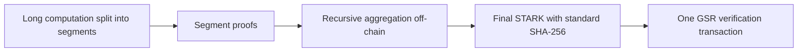

**Research: recursive STARK verification under this GSR branch**

Researched 27 September 2026. Objective: support long computations through recursion, with a complete on-chain verification transaction that fits the branch's limits. This is a source-based feasibility assessment, not a benchmark of a completed GSR verifier.

**Updated decision: select OpenVM v2.0.2's recursively aggregated SWIRL STARK (`VmStarkProof`) as the real computation and recursion stack.** See the [follow-up system decision](/Users/ekrembal/Developer/chainway/temp/gsr-stark-verifier/recursive-proof-system-decision.md) for the pinned implementation, actual Plonky3 users, alternatives, and source evidence. This supersedes this report's initial Stwo-first recommendation and its proposal to defer WHIR. OpenVM already implements WHIR inside a complete recursive proving system. Measure its stock Poseidon2 aggregate before deciding whether a custom SHA-256 outer proof is necessary.

The original Plonky3 recommendation is reasonable for building a small standalone verifier. Your recursion requirement changes the evaluation: the Bitcoin Circle-STARK authors already describe a recursive pipeline that switches to SHA-256 at its final layer. However, their checked-in Bitcoin demo is split across transactions and uses a small Fibonacci example. It is evidence of useful implementation work, not evidence that a long-computation proof already fits one GSR transaction. [Authors' recursion design](https://l2ivresearch.substack.com/p/recursive-proofs-in-stwo-part-ii), [demo implementation](https://github.com/Bitcoin-Wildlife-Sanctuary/bitcoin-circle-stark/blob/9540164f243b23e4ca995c153f70ec64744df28a/src/dsl/plonk/covenant.rs).

No examined source establishes an audited, complete recursive verifier that already fits this exact GSR branch. The next implementation milestone should establish that fact before committing to a larger integration.

**What must fit on-chain**

The local Bitcoin checkout is clean at `d2799052604eb138c5a79acf88514a0c8b07f4ef`, branch `gsr-full`. Its important limits are:

| Resource | Limit at this commit | Consequence |
|---|---:|---|
| Standard transaction weight | 400,000 WU | The practical first target for a single ordinarily relayed transaction after activation |
| Block weight | 4,000,000 WU | A consensus ceiling shared with every other transaction and the coinbase |
| Individual v2 stack element | 4,000,000 bytes | An execution limit, not permission for a 4 MB standard witness |
| Stack + altstack entries, including definitions | 32,768 | Parse and discard incrementally rather than keeping every coefficient live |
| Live stack/altstack/definition payload | 8,000,000 bytes | Includes copies and stored function bodies |
| Cumulative invoked function-body bytes | 4,000,000 | Every invocation counts the entire body again |
| Varops budget | 10,000 × eligible transaction WU | Shared across participating v2 executions |

Sources: [policy weight](https://github.com/jmoik/bitcoin/blob/d2799052604eb138c5a79acf88514a0c8b07f4ef/src/policy/policy.h#L38), [block weight](https://github.com/jmoik/bitcoin/blob/d2799052604eb138c5a79acf88514a0c8b07f4ef/src/consensus/consensus.h#L15), [stack limits](https://github.com/jmoik/bitcoin/blob/d2799052604eb138c5a79acf88514a0c8b07f4ef/src/script/script.h#L43-L52), [function accounting](https://github.com/jmoik/bitcoin/blob/d2799052604eb138c5a79acf88514a0c8b07f4ef/src/script/interpreter.cpp#L2390-L2427), [transaction budget](https://github.com/jmoik/bitcoin/blob/d2799052604eb138c5a79acf88514a0c8b07f4ef/src/script/interpreter.cpp#L2734-L2757).

For a transaction whose inputs all participate in v2:

`transaction weight = 4 × non-witness bytes + witness serialization bytes`

The witness must include the proof, revealed verifier script, checked hints, public data supplied there, item-length prefixes, and Taproot control block. A 200 kB proof does not imply a 200 kB verification transaction. The current v2 policy does not inherit the 80-byte stack-item policy imposed on original tapscript. [Witness policy](https://github.com/jmoik/bitcoin/blob/d2799052604eb138c5a79acf88514a0c8b07f4ef/src/policy/policy.cpp#L322-L345).

These illustrative allocations show the relevant constraint; they are not measured proof sizes:

| Proof bytes | Script bytes | Hints/other witness bytes | Other weight allowance | Total weight | Weight gate |
|---:|---:|---:|---:|---:|---|
| 100,000 | 100,000 | 20,000 | 1,000 WU | 221,000 WU | Fits |
| 200,000 | 120,000 | 20,000 | 1,000 WU | 341,000 WU | Fits, limited headroom |
| 300,000 | 80,000 | 30,000 | 1,000 WU | 411,000 WU | Exceeds standard weight |

I would set an engineering target of **at most 300,000 WU for the complete transaction**, leaving room below the 400,000 WU policy limit. Passing this weight gate still requires passing execution, stack, function, and all other transaction checks. A larger consensus-valid transaction would need a different relay/mining arrangement; it should not be the default success criterion.

This is a proposed-script environment: the branch leaves mainnet activation at `NEVER_ACTIVE`. Feasibility here means under activated GSR rules, initially exercised on regtest. [Activation setting](https://github.com/jmoik/bitcoin/blob/d2799052604eb138c5a79acf88514a0c8b07f4ef/src/kernel/chainparams.cpp#L138-L143).

**A possible outer-proof architecture for long computations**

The following SHA-256 final layer is an adaptation option. It is not the stock OpenVM proof selected in the follow-up decision.

With a bounded segment size, each leaf proves a bounded computation. Recursive aggregation proves that the segments are valid and compose correctly. A final layer proves the aggregate verifier's execution using an on-chain-friendly commitment and transcript configuration. The chain checks that final proof; it does not replay every segment verifier.

**Cryptographic recursion does not require recursive Script calls.** GSR's prohibition on recursive `OP_INVOKE` does not prevent this architecture.

Changing the outer hash is a proving-system configuration change. It is not rehashing an existing serialized proof. The final prover must prove the actual recursive-verifier computation, including the inner hash checks. Using Poseidon internally does not require Bitcoin to execute every internal Poseidon hash: those executions are enforced by the final proof's constraints. Conversely, simply changing SHA implementations in a verifier will invalidate existing proofs.

Recursion must also enforce the application statement. For a segmented execution, bind the program or verification-key identity, initial and final state commitments, adjacent segment boundaries, execution order, and claimed outputs. Fix or authenticate the final circuit's identity in the Bitcoin locking condition. An aggregation of unrelated valid proofs does not establish one valid long computation.

A fixed-size final proof is an architectural goal that requires fixed verifier shapes or normalization. Repeating recursion alone is insufficient: circuit shapes can grow between levels, and a full pipeline must demonstrate that the outer verifier remains bounded as the segment count increases.

**Candidate assessment under the recursion requirement**

| Candidate | Evidence for long computations/recursion | Remaining GSR work | Assessment |
|---|---|---|---|
| OpenVM v2.0.2 SWIRL/WHIR | Existing segment, leaf, and recursive internal aggregation producing one `VmStarkProof` | Port the actual verifier and claim checks; measure Poseidon2 and the complete spend | Selected in the follow-up research |
| Stwo/Circle + Bitcoin-specific final proof | Cairo recursion exists; separate Bitcoin-oriented work demonstrates recursive proof generation and final hash switching | Connect the selected application/VM to the final proof, port unsigned arithmetic, consolidate the verifier, measure the complete spend | Alternative, especially for Cairo applications |
| Plonky3 + Plonky3-recursion + SHA-256 final layer | Recursive uni-STARK/batch-STARK verification and aggregation exist | Implement/integrate the final SHA-256 configuration and Script verifier; establish stable shapes and security | Custom research option; generic recursion library remains unaudited |
| RISC Zero succinct STARK receipt | Segment lifting and repeated joins are an existing execution pipeline | Direct suite implementation or a new GSR-friendly final layer; receipt-claim binding | Strong arbitrary-program backend candidate |
| SP1 compressed proof | Existing shard normalization and recursive aggregation | Outer hash/arithmetic port or new final layer; additional assumption review | Viable only if its full assumptions are acceptable |
| Standalone WHIR commitment scheme | Implemented PCS with promising communication costs | A PCS benchmark still omits application and recursive-verifier constraints | OpenVM supplies a complete recursive use; assess that stack directly |
| Stone/Cairo large-prime STARK | Existing Cairo ecosystem and verifier | Full final proof/hash profile and constraint port | Arithmetic comparison, not the first integration target |

**Stwo has more relevant prior work than the pasted recommendation implies.** The authors explicitly describe using recursion-friendly hashing internally, switching the final proof to SHA-256, and changing the final AIR and blowup factor to reduce on-chain work. This supports the proposed architecture. It does not transfer a security level or cost result to GSR. [Recursive proof construction](https://l2ivresearch.substack.com/p/recursive-proofs-in-stwo-part-ii).

I inspected Bitcoin Circle-STARK at `9540164f243b23e4ca995c153f70ec64744df28a`. Its covenant constructor builds **72 stages: 7 initial stages, 8 stages for each of 8 queries, and 1 cleanup stage**. The bundled hints are generated from `prove_fibonacci_plonk` with `LOG_N_ROWS = 5`. This is a small example and a split verifier, not a demonstrated single-spend verifier for a long Cairo execution. [Stage construction](https://github.com/Bitcoin-Wildlife-Sanctuary/bitcoin-circle-stark/blob/9540164f243b23e4ca995c153f70ec64744df28a/src/dsl/plonk/covenant.rs), [example input](https://github.com/Bitcoin-Wildlife-Sanctuary/bitcoin-circle-stark/blob/9540164f243b23e4ca995c153f70ec64744df28a/src/dsl/plonk/hints/mod.rs).

Its lockfile pins a separate Stwo fork at `d4c18cb8c5ea823312b097bc620e99e4da8f864b`. In that revision, the default, absent the two alternate blowup features, is a **1,024× blowup, 8 queries, and 20 proof-of-work bits**. Those defaults help explain the small query count; they are not a validated security recommendation. Do not carry them into a new deployment based on an old query-only estimate. [Dependency pin](https://github.com/Bitcoin-Wildlife-Sanctuary/bitcoin-circle-stark/blob/9540164f243b23e4ca995c153f70ec64744df28a/Cargo.lock), [fork parameters](https://github.com/Bitcoin-Wildlife-Sanctuary/stwo/blob/d4c18cb8c5ea823312b097bc620e99e4da8f864b/crates/prover/src/core/prover/mod.rs#L21-L42).

Modern Stwo Cairo has a Cairo-language recursive verifier and reports production use in SHARP. Its repository says development moved to `starkware-libs/proving` at the end of July 2026. That production lineage is separate from the older Bitcoin fork. Connecting current Cairo proofs to the Bitcoin-oriented final proof remains an integration task. [Stwo Cairo status and migration](https://github.com/starkware-libs/stwo-cairo/blob/main/README.md), [current proving repository](https://github.com/starkware-libs/proving).

**Plonky3 is a credible alternative, but the recursion library changes the maturity assessment.** I inspected Plonky3 v0.8.0 (`a21e3ed42905040ad49c519e402f018381c12d0c`) and Plonky3-recursion at `8f9876efb26cff0f4b837555b478f043c4314240`. The recursion library supports aggregation and Goldilocks/BabyBear/KoalaBear examples. Its documented hash choices are Poseidon1/Poseidon2, and its README explicitly says it is unaudited and not recommended for production. I did not find a documented ready-made SHA-256 final-wrapper path in the inspected examples. Such a path is plausible engineering work, not established turnkey functionality. [Pinned recursion README](https://github.com/Plonky3/Plonky3-recursion/blob/8f9876efb26cff0f4b837555b478f043c4314240/README.md).

The core toolkit has the necessary padded SHA-256 and full-hash compression adapter. `Sha256Compress` is a different primitive that omits padding. The byte-level transcript also matters: the Goldilocks serializing challenger uses rejection sampling; replacing it with simple reduction modulo the field would change the protocol. [SHA implementation](https://github.com/Plonky3/Plonky3/blob/a21e3ed42905040ad49c519e402f018381c12d0c/sha256/src/lib.rs), [compression adapter](https://github.com/Plonky3/Plonky3/blob/a21e3ed42905040ad49c519e402f018381c12d0c/symmetric/src/compression.rs), [challenge sampling](https://github.com/Plonky3/Plonky3/blob/a21e3ed42905040ad49c519e402f018381c12d0c/challenger/src/serializing_challenger.rs#L366-L391).

Plonky3's 2024 Least Authority audit reviewed identified 2024 revisions. It does not establish audit coverage of the separate recursion library or of all components in the September 2026 release. The v0.8.0 release includes substantial transcript and soundness-accounting changes, reinforcing the need to pin the complete configuration. [Audit scope](https://leastauthority.com/wp-content/uploads/2024/11/Updated_071124_Polygon_Plonky3_Final_Audit_Report.pdf), [v0.8.0 release](https://github.com/Plonky3/Plonky3/releases/tag/v0.8.0).

**RISC Zero deserves consideration for the computation backend.** Its documented pipeline lifts segment receipts and joins them until one succinct STARK receipt remains. The documentation gives approximately **200 kB** for a succinct STARK, before the optional Groth16 compression. That is potentially compatible with the witness-size envelope, but leaves less than roughly 200 kB for the Script verifier and everything else. This is an upstream approximate size, not a measurement here. [Recursive proving and receipt sizes](https://dev.risczero.com/api/recursion).

Its SHA `hash_pair` is raw compression and is explicitly not standard padded SHA-256. However, its stock `ProverOpts::succinct()` uses Poseidon2, so raw SHA compression is not a reason to reject the default recursive receipt. A direct receipt port still needs a complete meter assessment. Stopping before Groth16 retains the STARK receipt, but does not automatically solve its hash compatibility. [Hash-pair semantics](https://docs.rs/risc0-zkvm/latest/risc0_zkvm/guest/sha/trait.Sha256.html), [succinct configuration](https://docs.rs/risc0-zkvm/3.0.6/src/risc0_zkvm/host/client/prove/opts.rs.html).

**SP1 has recursion, but “STARK” is insufficient to establish a hash-only system.** Its compressed mode produces constant-size STARK proofs, and its current recursion documentation describes shard normalization followed by aggregation. Its current global-memory documentation also specifies a multiset hash using elliptic-curve addition. If the pasted recommendation's strict avoidance of discrete-log assumptions remains a requirement, omitting Groth16 is insufficient; this memory argument must also be addressed. A hash-based outer proof cannot repair an unsound inner argument. [Proof modes](https://docs.succinct.xyz/docs/sp1/generating-proofs/proof-types), [recursion](https://docs.succinct.xyz/docs/sp1/hypercube/recursion), [memory argument](https://docs.succinct.xyz/docs/sp1/hypercube/global).

**WHIR is relevant to witness size, but is a component rather than a complete application recursion system.** A May 2026 PSE implementation reports **54,436 bytes of calldata** for a standalone degree-size `2^22` opening with a stated 100-bit Johnson-bound target, KoalaBear quintic extension, and 28 grinding bits. Its measured verifier is dominated by extension-field work. This is more relevant evidence than native verification time alone, but it is neither a complete recursive-computation proof nor a GSR measurement. The PSE article also explains why its main benchmark uses Johnson-bound parameters rather than the earlier aggressive capacity estimates. [PSE implementation report](https://pse.dev/blog/evm-verification-of-whir-31bit).

Plonky3 v0.8.0 includes WHIR, while the original reference implementation still calls itself an academic prototype. The follow-up research establishes a more relevant production implementation: OpenVM 2.0 uses SWIRL/WHIR, with an audit covering the native and recursive verifiers and continuation machinery. The original prototype's status is therefore not grounds to defer every WHIR-based system. [Plonky3 release](https://github.com/Plonky3/Plonky3/releases/tag/v0.8.0), [reference implementation](https://github.com/worldfnd/whir), [OpenVM production release](https://blog.openvm.dev/2.0-production).

Stone remains a useful large-field comparison, but a full Cairo AIR/public-input verifier is more work than a modular field benchmark. Winterfell explicitly remains unaudited and not production-ready. Neither displaces the complete recursive stacks selected for closer consideration. [Stone scope](https://github.com/starkware-libs/stone-prover), [Winterfell status](https://github.com/facebook/winterfell).

**What the branch's meter actually tells us**

I compiled a small C++ program against the checkout's actual `varops.h` and evaluated its cost functions. It reproduces the pasted arithmetic figures:

| Primitive | Varops units |
|---|---:|
| `CAT SHA256` on two 32-byte children | 5,892 |
| `MUL 
 MOD`, 4-byte operands and modulus | 7,720 |
| Same, 8-byte operands and modulus | 8,028 |
| Same, 32-byte operands and modulus | 15,004 |
| `OP_2 OP_MULTI OP_SHA256` on two children | 6,966 |

These are **evaluated metering formulas**, not timed execution or complete verifier measurements. Arithmetic rows include pushing the modulus and assume a full-width product. They omit operand retrieval, validation, preservation, and call overhead. Hash rows omit child ordering and path-index handling. The `OP_MULTI` row is more expensive than `CAT SHA256` in this particular two-child case because of its logical-operation charges and count handling. [Cost functions](https://github.com/jmoik/bitcoin/blob/d2799052604eb138c5a79acf88514a0c8b07f4ef/src/script/varops.h), [multi-operation accounting](https://github.com/jmoik/bitcoin/blob/d2799052604eb138c5a79acf88514a0c8b07f4ef/src/script/interpreter.cpp#L119-L228).

The original example's 6,400 Merkle parents consume **37,708,800 units**. Its 204,800 sibling bytes contribute **2,048,000,000 units** to an eligible witness's budget. Parent hashing alone therefore uses approximately **1.84%** of that contribution. This supports an important inference: for a native-SHA-256 design, serialized witness size may become restrictive before internal Merkle hashing does. It does not establish that algebra, transcript work, or stack movement will fit.

64-bit modular multiplication is only about 4% more expensive than 4-byte multiplication in this example. Goldilocks is therefore a sensible baseline. However, compare **complete extension operations** and opened data: QM31 has four 31-bit coefficients; Goldilocks quadratic has two 64-bit coefficients. Both occupy 16 bytes in common fixed-width encodings, while their base-field trace rows differ. Goldilocks cubic is also implemented in the inspected release and offers a larger challenge space if the security calculation requires it. [Goldilocks extensions](https://github.com/Plonky3/Plonky3/blob/a21e3ed42905040ad49c519e402f018381c12d0c/goldilocks/src/extension.rs).

For function reuse, account for both the call charge and executed body bytes. A body of 200 bytes invoked 20,000 times alone reaches the 4,000,000-byte cap, regardless of how small the serialized script is. Prefer substantial reusable operations, and measure both counters. Native multiplication can remove much of the older CAT verifier's arithmetic emulation, but the required reduction in total code size is still unmeasured.

**Security parameters must be settled before comparing final witnesses**

Use an explicit target and assumption set for the entire recursive construction. A field with approximately 128 bits of cardinality is not automatically a 128-bit-sound proof: algebraic degree, batching, query soundness, grinding, transcript composition, and repeated recursion all matter. A conservative union-bound planning estimate for `m` checks each having error `epsilon` is `m × epsilon`; the final profile needs its actual recursive-composition argument rather than assuming the error stays unchanged.

The inspected Plonky3 security module separates AIR, DEEP, and proximity-test error sources and distinguishes proven and conjectured regimes. Its output is useful for parameter selection, but should not be relabeled as an end-to-end quantum-security certificate. Benchmark every candidate under equivalent assumptions. [Security accounting](https://github.com/Plonky3/Plonky3/blob/a21e3ed42905040ad49c519e402f018381c12d0c/security/src/lib.rs), [assumption definitions](https://github.com/Plonky3/Plonky3/blob/a21e3ed42905040ad49c519e402f018381c12d0c/security/src/assumption.rs).

If post-quantum security remains a requirement, retain the original recommendation's SHA-256 qualification: generic quantum collision query complexity is about `2^(256/3)`, not `2^128`. This does not by itself give the attack cost of a particular STARK, but prevents assuming a 128-bit quantum claim from the digest name. [Quantum collision algorithm](https://arxiv.org/abs/quant-ph/9705002).

There is also a separate deployment issue: a post-quantum proof system does not make current Taproot outputs post-quantum. Taproot exposes an elliptic-curve output key and permits a key-path spend. Its spending security therefore still depends on the curve assumptions, even when its script verifies a hash-based proof. This conclusion concerns the Bitcoin envelope, independently of the proof's soundness. [BIP 341 spending rules](https://bips.dev/341/).

**The experiment that would establish feasibility**

1. Choose a representative segmented computation with authenticated state transitions. Exercise increasing segment counts and at least several aggregation levels; a lone Fibonacci proof is only a development fixture.
2. Produce OpenVM's real `VmStarkProof` using the versions and production settings pinned in the follow-up decision. Preserve raw proof bytes, the trusted verification baseline, and actual generated parameters. Exercise multiple recursion levels.
3. Translate that verifier to GSR using native modular arithmetic and the actual Poseidon2 profile. Freeze proof encoding, transcript messages, field extensions, roots, query schedule, and program binding. Checked inversion hints and Merkle-path deduplication can reduce work or bytes, but count their full witness and bookkeeping costs. A padded-SHA-256 outer proof is a separate adaptation to evaluate if the stock profile fails the resource gates.
4. Serialize the **actual spend** and execute it under the branch's activated v2 rules. Record transaction WU, proof/script/hint bytes separately, consumed/available varops, invoked-body bytes, peak stack entries and bytes, final-layer proving time, and aggregate proving time.
5. Require the complete transaction to pass the 400,000-WU policy gate, preferably at or below the proposed 300,000-WU target, and every execution limit. Recheck the same gates as recursion depth and segment count increase. If the outer shape grows, normalization is unfinished.

The most useful next result is a complete recursive proof plus its GSR verifier transaction with these measurements. An arithmetic microbenchmark, a small standalone proof, or a compressed JSON file cannot establish the requested on-chain feasibility.

**Verification performed for this research:** read the pinned GSR implementation; inspected pinned Plonky3, Plonky3-recursion, and Bitcoin Circle-STARK source snapshots; checked primary recursion, proof-format, and audit documentation; compiled and ran the meter calculation helper. No complete proof pipeline or GSR verifier was built or benchmarked, and no Bitcoin source files were modified.
