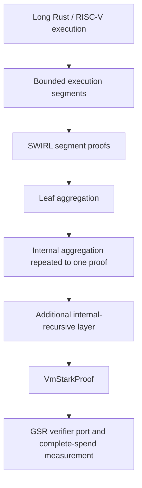

**Decision: use OpenVM's recursively aggregated SWIRL STARK**

Research date: 27 September 2026. This selects the real computation and recursion stack for the GSR project. It supersedes the earlier Stwo-first prototype recommendation in [potential-starks.md](/Users/ekrembal/Developer/chainway/temp/gsr-stark-verifier/potential-starks.md).

**Choose OpenVM v2.0.2, ending at `VmStarkProof`.** Use its existing execution segmentation and recursive aggregation, with its pinned SWIRL/WHIR backend, BabyBear arithmetic, and Poseidon2 hashing. Keep its production parameters for the first integration. The EVM Halo2/KZG wrapper is outside this selection. This is an engineering choice based on an implemented recursive pipeline, relevant audit coverage, and accessible backend interfaces. **A complete GSR spend fitting all limits remains unmeasured.**

I assume general-purpose long computations and retain the supplied recommendation's requirement to avoid elliptic-curve commitments and accumulators in the proof system. The source material does not establish a requirement for 128-bit quantum security; OpenVM's advertised 100-bit profile must not be relabeled as one.

**How people actually use Plonky3**

Plonky3 supplies fields, arithmetic, hashes, commitments, and proving components. Applications add VM constraints, memory consistency, continuation semantics, recursive-verifier circuits, proof normalization, and application-claim verification. Consequently, “use Plonky3 with SHA-256” leaves most of the required recursive system unspecified. Existing applications have their own recursion implementations; the maturity of those implementations is separate from the generic Plonky3-recursion repository.

| System | Concrete use and recursive pipeline | Decision for this project |
|---|---|---|
| **OpenVM** | Plonky3 components underneath SWIRL; execution segments → leaf aggregation → internal aggregation → one `VmStarkProof` | **Selected.** Complete continuation and recursion machinery, with a separate STARK output and reviewed implementation |
| **SP1** | Plonky3-derived infrastructure; Hypercube core shards → normalized proofs → recursive compression; optional shrink/Groth16 | Strong general-purpose alternative, but its current global-memory accumulator uses elliptic curves, conflicting with the retained assumption set |
| **Pico** | Plonky3 backend and SP1-derived recursion compiler; RISC-V → convert → combine → compress → embed; optional Gnark SNARK | Real alternative. BabyBear/KoalaBear recursion exists; its advertised M31 option does not yet provide the complete recursive path |
| **Miden** | Current releases use Plonky3 dependencies and supply in-VM recursive verifiers and batch verification examples | Credible alternative, especially for Miden applications; latest releases change proof transport and verifier identities, and no demonstrated GSR cost advantage was found |
| **Plonky3-recursion** | Generic uni-STARK/batch-STARK recursive verification and two-to-one aggregation | Useful for custom research; its maintainers explicitly describe it as unaudited and unsuitable for production |

Sources: [OpenVM continuation specification](https://github.com/openvm-org/openvm/blob/v2.0.2/docs/vocs/docs/pages/specs/architecture/continuations.mdx), [SP1 recursion](https://docs.succinct.xyz/docs/sp1/hypercube/recursion), [SP1 memory argument](https://docs.succinct.xyz/docs/sp1/hypercube/global), [Pico backend status](https://github.com/brevis-network/pico/blob/main/README.md), [Pico pipeline](https://pico-docs.brevis.network/writing-apps/advanced/proverchain), [Miden release history](https://github.com/0xMiden/miden-vm/blob/next/CHANGELOG.md), [Plonky3-recursion status](https://github.com/Plonky3/Plonky3-recursion/blob/8f9876efb26cff0f4b837555b478f043c4314240/README.md).

Pico's README reports a Sherlock review and recommends production use. Its modularity is relevant, but that alone does not establish a cheaper GSR verifier or an equivalent security profile. I have not audited its complete assumption chain and do not infer that it shares SP1's current memory argument merely from its ancestry. Miden v0.33.0, released September 16, includes a batch recursive-verification example and changes proof transport to version 2. It should not be dismissed using older claims that recursion is only planned. [Pico status](https://github.com/brevis-network/pico/blob/main/README.md), [Miden changes](https://github.com/0xMiden/miden-vm/blob/next/CHANGELOG.md).

**The exact OpenVM stack to pin**

| Component | Selected configuration |
|---|---|
| OpenVM | v2.0.2, commit `59a69b8b0cbee7011ac978e4cc07707ee3681944` |
| STARK backend | v2.0.1, commit `362c7ad8c6b042b320471a137e3eadec7ec69a44` |
| Plonky3 dependencies | Exact `0.4.3` versions pinned by that backend |
| Proof system | SWIRL: sumcheck-based constraints, GKR LogUp, stacked polynomial reduction, WHIR commitments |
| Base/challenge fields | BabyBear and its degree-four binomial extension |
| Hash/transcript | Poseidon2 over BabyBear; width 16, rate 8, eight-field-element digests |
| Output | `VmStarkProof`, including its public-values authentication data |
| Reference verifier | `verify_vm_stark_proof_decoded` with `VmStarkVerifyingKey` and a trusted `VerificationBaseline` |
| Initial workload | Fixed RV32IM guest, fixed public-output layout, ordinary execution continuations |

Sources: [OpenVM release](https://github.com/openvm-org/openvm/releases/tag/v2.0.2), [backend dependency](https://github.com/openvm-org/openvm/blob/v2.0.2/Cargo.toml), [backend's Plonky3 pins](https://github.com/openvm-org/stark-backend/blob/v2.0.1/Cargo.toml), [hash and field configuration](https://github.com/openvm-org/stark-backend/blob/v2.0.1/crates/stark-sdk/src/config/baby_bear_poseidon2.rs), [proof and verification entry points](https://github.com/openvm-org/openvm/blob/v2.0.2/crates/verify/src/lib.rs).

This specifically does **not** mean upgrading OpenVM to the latest Plonky3 release. Its pinned dependency set and its own recursive circuits are the unit of integration.

The SDK's `prove` method returns an aggregated `VmStarkProof` and its baseline. Source inspection confirms aggregation continues until one proof remains; `StarkProver::prove` then adds another internal-recursive layer to reduce its size. Default branching is four app proofs per leaf and three children per internal node. The implementation accepts a recursion-depth field up to 256; its practical support for very long computations does not imply literally unlimited implementation resources. [SDK entry point](https://github.com/openvm-org/openvm/blob/v2.0.2/crates/sdk/src/lib.rs), [aggregation loop](https://github.com/openvm-org/openvm/blob/v2.0.2/crates/sdk/src/prover/agg.rs), [additional layer](https://github.com/openvm-org/openvm/blob/v2.0.2/crates/sdk/src/prover/stark.rs), [branching](https://github.com/openvm-org/openvm/blob/v2.0.2/crates/sdk/src/config.rs), [depth bound](https://github.com/openvm-org/openvm/blob/v2.0.2/crates/verify/src/pvs.rs).

The existing CLI path is `cargo openvm setup`, `cargo openvm keygen`, and `cargo openvm prove stark`, after building/configuring the guest. `prove app` leaves the segment proofs unaggregated. OpenVM's **root** and **static** layers belong to the EVM pipeline; they are not required to obtain the selected aggregate STARK. These commands document the integration path and were not executed in this research. [Proving guide](https://docs.openvm.dev/book/writing-apps/generating-proofs/), [pipeline definitions](https://github.com/openvm-org/openvm/blob/v2.0.2/docs/vocs/docs/pages/specs/architecture/continuations.mdx).

There are two distinct capabilities. Ordinary continuations prove one long execution across segments. Application-level recursion verifies other application proofs inside a guest. OpenVM also implements the latter through `openvm-verify-stark-guest` and its deferred verification circuit. That requires SDK configuration; the documented CLI does not support deferrals. Start with continuations, then add proof composition when the application needs it. [Verify-STARK library](https://github.com/openvm-org/openvm/blob/v2.0.2/docs/vocs/docs/pages/book/guest-libraries/verify-stark.mdx).

**Why this changes the earlier recommendation**

OpenVM 2.0 is a complete, reviewed use of WHIR inside a recursive computation system. My earlier assessment treated WHIR mainly as a standalone commitment optimization and omitted this implementation. Its July 10 production announcement reports proofs below 300 kB and Ethereum-block STARK benchmarks on GPU clusters. These are upstream results for their workloads and hardware, not local measurements or guarantees for this application. The associated Ethereum application repository separately warns that it is unaudited; the framework's status should not be extended to every guest application. [Production announcement](https://blog.openvm.dev/2.0-production), [benchmark application](https://github.com/axiom-crypto/openvm-eth).

The zkSecurity report covers SWIRL, the native and recursive verifiers, continuations, deferrals, and the static verifier in specified audit phases. I read its scope and revision descriptions. This is substantially more relevant evidence than an old audit of Plonky3 primitives alone. It is still an audit of identified revisions and changes, not certification of every v2.0.2 dependency, future configuration, or GSR port. [Audit report](https://github.com/openvm-org/openvm/blob/v2.0.2/audits/v2/v2.0.0-zksecurity-report.pdf).

OpenVM documents a 100-bit target with Poseidon2 in an ideal-permutation model and proven proximity bounds; the production announcement describes its profile as post-quantum. Treat those as the upstream model and claim, not an independent end-to-end certification from this research. The pinned backend exposes parameter selection and soundness calculations with explicit circuit-size assumptions. Preserve them and record the actual generated parameters. In particular, its `DEFAULT_K_WHIR` is 4, while the security-document table in the OpenVM snapshot lists 3: copying that table is not a substitute for extracting the running configuration. [Security model](https://github.com/openvm-org/openvm/blob/v2.0.2/docs/vocs/docs/pages/specs/security/security-model.mdx), [actual backend parameters](https://github.com/openvm-org/stark-backend/blob/v2.0.1/crates/stark-sdk/src/config/mod.rs).

**What still determines GSR feasibility**

OpenVM's stock final proof uses Poseidon2. Bitcoin's padded SHA-256 opcode cannot verify those commitments directly. My recommendation is to measure the unchanged aggregate first, preserving a reference proof and verifier. Whether to add a SHA-256 outer proof is a subsequent decision driven by that measurement. Such a wrapper would require a new prover configuration and soundness review; it is not an available `--sha256` switch or a re-encoding of the existing proof.

There is also a concrete serialization issue. The CLI emits a versioned JSON representation with hex-encoded proof fields. The host byte-stream verifier accepts a zstd-compressed encoding, and the benchmark code reports both raw and compressed lengths. GSR has no native zstd decoder. Therefore use canonical raw proof data or a specifically verified compact encoding when estimating its witness, and do not count JSON characters or assume compressed download size is on-chain size. The published 300 kB headline was not tied to a reproduced raw sample in this research. [CLI representation](https://github.com/openvm-org/openvm/blob/v2.0.2/crates/sdk/src/types.rs), [host decoder](https://github.com/openvm-org/openvm/blob/v2.0.2/crates/verify/src/lib.rs), [both size metrics](https://github.com/openvm-org/openvm/blob/v2.0.2/benchmarks/prove/src/lib.rs).

For this branch the standard-transaction ceiling is **400,000 WU**. A raw 300,000-byte witness proof would leave less than 100,000 WU for script, hints, control block, remaining witness serialization, and base transaction weight. Passing that gate would still require fitting the varops budget, 4,000,000 cumulative invoked-body bytes, and stack limits. No published OpenVM benchmark establishes these GSR measurements. See the [local limit analysis](/Users/ekrembal/Developer/chainway/temp/gsr-stark-verifier/potential-starks.md) and [pinned policy](https://github.com/jmoik/bitcoin/blob/d2799052604eb138c5a79acf88514a0c8b07f4ef/src/policy/policy.h#L38).

The reference verification target includes more than the inner polynomial proof. It authenticates user public values, checks the executable commitment and successful termination, binds the aggregation verification keys, and validates recursion metadata. The trusted baseline must be fixed or authenticated by the spending condition; accepting a baseline supplied freely by the prover changes the statement being proved. [Reference checks](https://github.com/openvm-org/openvm/blob/v2.0.2/crates/verify/src/lib.rs), [baseline structure](https://github.com/openvm-org/openvm/blob/v2.0.2/crates/verify/src/vk.rs).

**Alternatives outside the selected stack**

| Alternative | Established recursive capability | Why it is not first |
|---|---|---|
| **RISC Zero `SuccinctReceipt`** | Lift segment receipts and repeatedly join them; approximately 200 kB according to its docs | Strongest fallback and a potentially better size result. Stock succinct proving uses Poseidon2, so it also needs a non-native hash implementation or a new outer proof; its smaller headline is not a complete GSR measurement |
| **Stwo/Cairo** | Production Cairo recursive verification and aggregation in the StarkWare ecosystem | Best alternative for Cairo workloads. The older Bitcoin SHA-256 demo is a separate fork and does not establish a complete current Cairo-to-GSR pipeline |
| **Triton VM** | Native recursive STARK verification, Goldilocks base field and cubic extension | Real option for a custom stack-machine workload, but no source-backed GSR fit advantage was established over the selected RISC-V stack |
| **Plonky2** | Implemented and previously audited recursion | Officially deprecated; poor foundation for a new maintained integration |
| **Nova** | Real incremental verification through folding and optional compression | Current implementation uses curve cycles and Pedersen/KZG-family commitments, outside the retained hash-based requirement |

Sources: [RISC Zero recursion](https://dev.risczero.com/api/recursion), [its actual succinct options](https://docs.rs/risc0-zkvm/3.0.6/src/risc0_zkvm/host/client/prove/opts.rs.html), [Stwo Cairo production and migration](https://github.com/starkware-libs/stwo-cairo/blob/main/README.md), [Bitcoin demo provenance](https://github.com/Bitcoin-Wildlife-Sanctuary/bitcoin-circle-stark/blob/9540164f243b23e4ca995c153f70ec64744df28a/Cargo.lock), [Triton recursion](https://github.com/TritonVM/triton-vm), [Triton fields](https://triton-vm.org/spec/), [Plonky2 status](https://github.com/0xPolygonZero/plonky2/blob/main/README.md), [Nova commitments](https://github.com/microsoft/Nova).

RISC Zero is close enough that it should remain the fallback, rather than being rejected merely because a SHA implementation uses raw compression. That is a separate compatibility issue from its default Poseidon2 profile. My preference for OpenVM is its explicit modular backend, complete continuation/aggregation interfaces, and current reviewed SWIRL implementation; **I do not claim it has beaten RISC Zero on GSR cost**.

**The next acceptance result**

Produce one real, multi-segment OpenVM proof under the pinned production configuration, exercising multiple aggregation levels. Save the raw `VmStarkProof`, its trusted verifier/baseline, and all parameters. Then measure a verifier port against the actual activated GSR interpreter: total transaction weight, varops, invoked-body bytes, stack usage, and proof/script/hint sizes separately. Repeat with longer executions to confirm that the final verification envelope remains bounded.

The hard acceptance criterion is a complete valid spend under 400,000 WU and every execution limit. The previous 300,000-WU total target is optional headroom, not a protocol limit. If the stock final proof fails these measurements, evaluate a dedicated outer proof or the RISC Zero fallback before committing to a production GSR verifier. Do not reduce security settings to manufacture a fit.

**Research performed:** inspected pinned OpenVM and backend source, recursive control flow, serialization, public-claim verification, default configurations, and audit scope; checked primary documentation for the alternatives. No new prover run, full verifier implementation, or complete-transaction benchmark was performed in this follow-up. Bitcoin source was not modified.
